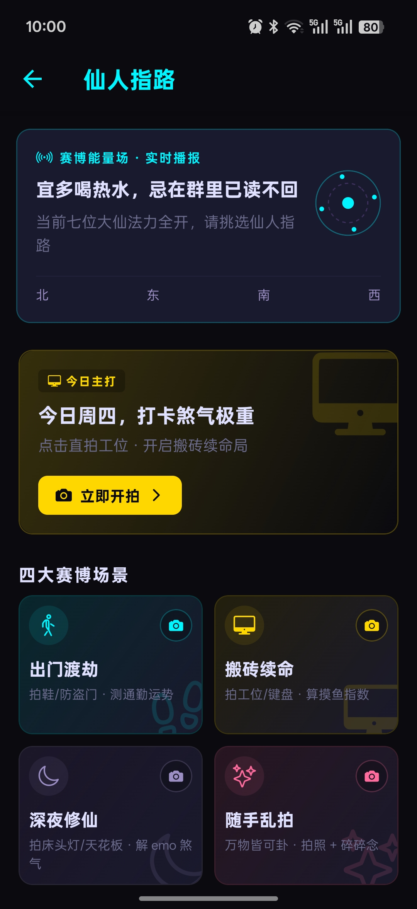
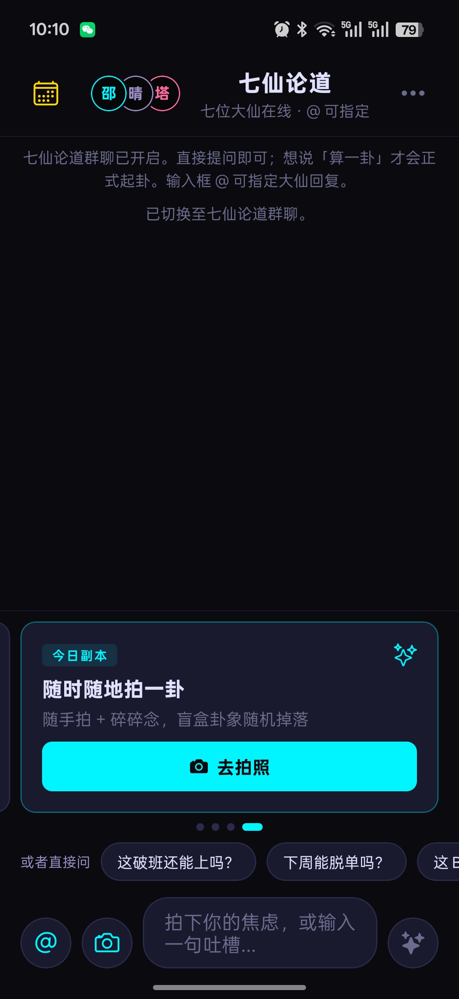
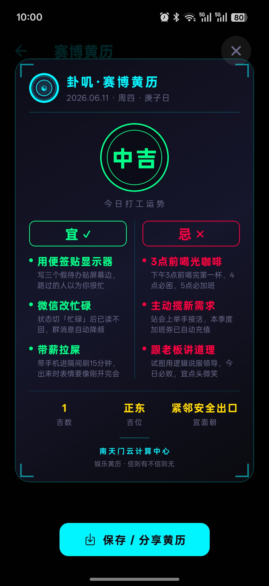

# 卦叽 · Guaji

> 赛博修仙 · 拍一卦

「卦叽」是一款基于 React Native / Expo 的 AI 玄学聊天应用。拍照或输入碎碎念，七位赛博大仙为你起卦解读；支持私聊、群聊、场景化占卜与分享海报。

---

## 预览

| 首页聊天 | 仙人指路 | 起卦仪式 |
|:---:|:---:|:---:|
|  |  |  |

| 群聊论道 | 黄历 | 设置 |
|:---:|:---:|:---:|
|  |  |  |

> 将截图放入 `docs/screenshots/` 目录，保持上述文件名即可自动显示。也可替换为任意路径，同步修改本文件中的引用。

---

## 功能概览

### 四大场景

| 场景 | 说明 | 拍照建议 |
|------|------|----------|
| 出门 | 通勤运势、避煞指南 | 鞋、外套、防盗门 |
| 工作 | 工位磁场、摸鱼指数 | 键盘、工位、咖啡 |
| 深夜 | emo 解药、深夜修仙 | 床头灯、天花板 |
| 拍卦 | 万能盲盒提问 | 随手拍 + 文字 |

### 七位大仙

| 角色 | 流派 | 特色 |
|------|------|------|
| 邵夫子 | 八卦 | 起卦观象 · 拍啥算啥 |
| 晴明 | 阴阳师 | 结界封签 · 专治深夜 emo |
| 卡珊德拉 | 塔罗 | 塔罗抽牌 · 专治职场站队 |
| 占星魔女 | 星座 | 星盘相位 · 专治水逆焦虑 |
| 袁天罡 | 八字 | 八字排盘 · 专治流年犯冲 |
| 麦尔斯 | MBTI | 人格扫描 · 专治内耗甩锅 |
| 功德僧 | 赛博佛系 | 功德结算 · 专治加班焦虑 |

### 其他能力

- **私聊 / 群聊**：私聊切换角色与专属仪式；群聊支持 `@` 指定大仙，说「算一卦」才正式起卦
- **用户记忆**：自动提取生活背景、偏好习惯等，让解读更贴合你
- **每日黄历**：本地黄历 + AI 生成今日运势文案
- **历史记录**：保存会话，一键恢复继续聊
- **分享海报**：卦象卡、对话摘录一键生成分享图

---

## 技术栈

- [Expo SDK 56](https://docs.expo.dev/) + [Expo Router](https://docs.expo.dev/router/introduction/)
- React Native 0.85 · React 19
- TypeScript · Zustand · TanStack Query
- 支持 OpenAI 兼容接口（豆包 / OpenAI / DeepSeek / Moonshot / 商汤等）

---

## 快速开始

### 环境要求

- Node.js 18+
- npm 或 yarn
- Android Studio（Android）/ Xcode（iOS，仅 macOS）
- 支持视觉理解的 AI API Key（需能处理图片输入）

### 安装与运行

```bash
# 克隆项目
git clone <your-repo-url>
cd photoFortune

# 安装依赖
npm install

# 启动开发服务器
npm start

# 或直接运行到设备
npm run android   # Android
npm run ios       # iOS
npm run web       # Web 预览
```

首次启动后，进入 **设置 → AI 算力**，填写 API 地址、Key 与模型名称；并在 **出生档案** 中完善基本信息后即可起卦。

---

## 配置说明

### AI 算力

应用使用 OpenAI Chat Completions 兼容格式，默认推荐豆包视觉模型：

| 配置项 | 说明 |
|--------|------|
| API URL | 如 `https://api.doubao.com/v1/chat/completions` |
| API Key | 对应平台的密钥 |
| 模型 | 需支持图片输入，如 `doubao-vision-pro-32k` |

内置预设可在设置页快速切换：豆包、OpenAI、DeepSeek、Moonshot、商汤。

#### 打包默认配置（可选，不提交 Git）

若希望**首次安装**时自动填入 AI 配置（用户仍可在设置里随时修改）：

1. 复制 `.env.example` 为 `.env.local`
2. 填写 `GUAJI_AI_API_KEY` 等变量（`.env.local` 已在 `.gitignore` 中）
3. 重新启动开发服务器或打包

构建时 `app.config.js` 会读取 `.env.local` 并注入 `extra.bundledAi`。**仅在首次安装且本地尚无 API Key 时写入一次**，之后以用户在设置中的配置为准。

> 注意：密钥会打进安装包，适合自用或内测；公开发布请改用服务端代理。

### 出生档案

用于八字、星座等角色的个性化解读，包含昵称、性别、出生日期与时辰等字段。

---

## 项目结构

```
photoFortune/
├── app/                    # Expo Router 页面
│   ├── index.tsx           # 主聊天页
│   ├── guide.tsx           # 仙人指路（场景 / 角色选择）
│   ├── almanac.tsx         # 黄历
│   ├── history.tsx         # 历史记录
│   └── settings.tsx        # 设置
├── src/
│   ├── components/         # UI 组件（聊天、仪式、分享等）
│   ├── constants/          # 角色、场景、主题配置
│   ├── prompts/            # 各角色与场景的 AI Prompt
│   ├── rituals/            # 起卦仪式逻辑
│   ├── services/           # AI、存储、群聊编排等服务
│   ├── stores/             # Zustand 状态
│   └── utils/              # 工具函数
├── assets/                 # 图标、塔罗牌面等资源
├── docs/screenshots/       # README 截图（需自行放入）
└── scripts/                # 构建辅助脚本
```

---

## 常用脚本

| 命令 | 说明 |
|------|------|
| `npm start` | 启动 Expo 开发服务器 |
| `npm run android` | 运行到 Android 设备 / 模拟器 |
| `npm run ios` | 运行到 iOS 设备 / 模拟器 |
| `npm run web` | Web 预览 |
| `npm run generate:icons` | 生成应用图标 |
| `npm run build:android` | EAS 云构建 Android |
| `npm run build:ios` | EAS 云构建 iOS |
| `npm run apk:release:full` | 本地 prebuild + 打 Release APK |

---

## 截图清单

请将以下截图放入 `docs/screenshots/`，或在 README 中替换为你的路径：

| 文件名 | 建议内容 |
|--------|----------|
| `home-chat.png` | 主聊天页（私聊模式，含场景卡） |
| `guide-lobby.png` | 仙人指路页（场景网格 + 角色 deck） |
| `ritual-bagua.png` | 任意一位大仙的起卦仪式界面 |
| `group-chat.png` | 群聊模式，多位大仙同屏 |
| `almanac.png` | 每日黄历卡片 |
| `settings.png` | 设置页（AI 算力 / 出生档案） |

可选补充：

| 文件名 | 建议内容 |
|--------|----------|
| `share-poster.png` | 分享海报预览 |
| `history.png` | 历史会话列表 |
| `tarot-ritual.png` | 塔罗抽牌仪式 |

---

## 许可证

私有项目，未经授权请勿分发。
